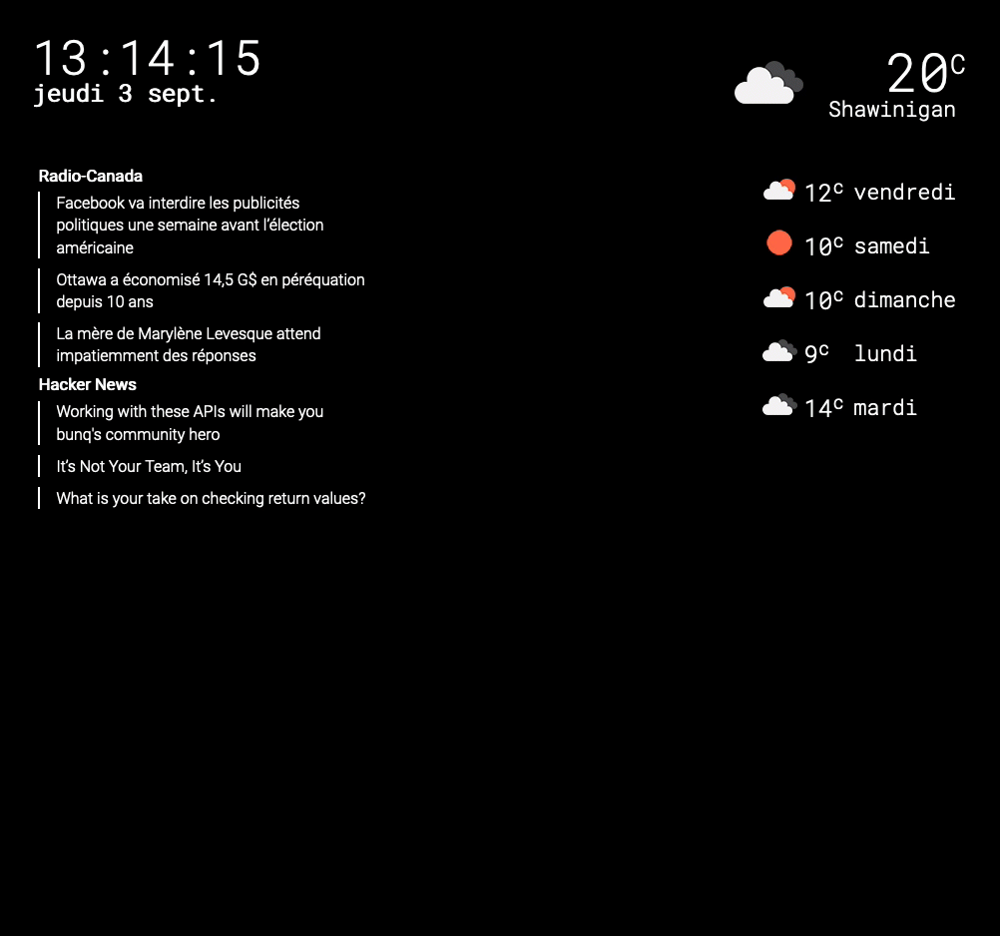

# Snowhite

> Mirror mirror, tell me who is the most beautiful



## Fetching deps

You need to fetch both node and elixir deps before playing with it. You can use the `make deps` target to do so.

## Initial setup

### Creating the project
Create a new phoenix project

```bash
mix phx.new my_mirror --no-ecto
```

*If you want to use Ecto, you can, but Snowhite doesn't require it.*

### Creating the profiles

Snowhite makes use of different profile to better split information. You can create multiple profile with multiple modules for different use cases. You first need to create the profile manager like the following. You **must** at least include a `:default` profile.


```elixir
defmodule MyMirror.Profiles do
  use Snowhite

  profile(:default, MyMirror.Profiles.Default)
end
```

You can create as much profile as you want as long as their name differs. You can switch between profile using either a param `?profile=another` or a `X-Snowhite-Profile: another` header. It would then load the `:another` profile instead of `:default`

#### Creating a profile and registering modules

You can register any module in the Profile module using the `register_module/3` macro.

```elixir
defmodule MyMirror.Profiles.Default do
  use Snowhite.Builder.Profile

  register_module(:top_left, Snowhite.Modules.Clock, locale: "fr")
end
```

It expects:
- A position; any of `[top|middle|bottom]_[left|center|right]` (ex. `top_left`, `bottom_right`, etc...)
- A module using either a `Snowhite.Builder.Module` or `Phoenix.LiveView`; Some examples modules are available in `lib/modules` [see here for custom modules](#creating-modules).
- A keyword list of options specific to module.

### Route the profiles

In your Phoenix's router, add the following call

```elixir
defmodule SnowhiteNboisvertWeb.Router do
  #...
  import Snowhite, only: [snowhite_router: 1]

  pipeline :browser do
    plug :accepts, ["html"]
    plug :fetch_session
    plug :fetch_flash
    plug :protect_from_forgery
    plug :put_secure_browser_headers
  end

  pipe_through :browser # Make sure you piped through the browser pipeline

  snowhite_router(SnowhiteNboisvert.Profiles)
end
```

Snowhite renders on `/`, so if you want to scope it under `/mirror`, for instance, you can do the following

```elixir
scope "/mirror" do
  snowhite_router(SnowhiteNboisvert.Profiles)
end
```

### Assets

Snowhite requires at least a js file located at `../deps/snowhite/assets/js/live.js`. Even though it does **not** require a CSS file, you might want to import the one provided with Snowhite to have basic styling at `../deps/snowhite/assets/css/app.scss`.

## Creating modules

**Important note**: To keep your system easily updatable, try to not update existing file/module. Always create new files or update those that exists for such purpose such as `_override.scss` and `snowhite.ex`.

You can create your own modules using either the `Snowhite.Builder.Module` or a any raw `Phoenix.LiveView` component.

For most use case, you might prefer to use the `Snowhite.Builder.Module` as it includes [some convenient functions](#convenient-functions). To use Phoenix.LiveView, refer to [the documentation](https://hexdocs.pm/phoenix_live_view)

The only required function is `render/1` as shown below.

```elixir
defmodule Snowhite.Modules.HelloWorld do
  use Snowhite.Builder.Module

  def render(assigns) do
    ~L"""
      <h1>Hello world.</h1>
    """
  end
end
```

### Other assigns

If you need other assigns in your module, you must override `mount/1` to define those. That function recieves a socket with `options` and `params` assigned.

```elixir
defmodule Snowhite.Modules.HelloWorld do
  use Snowhite.Builder.Module

  def mount(socket) do
    assign(socket, :message, "Hello, you weird person")
  end

  def render(assigns) do
    ~L"""
      <h1>@message</h1>
    """
  end
end
```

### Using options

You must first defined supported options like the following

```elixir
defmodule Snowhite.Modules.HelloWorld do
  use Snowhite.Builder.Module

  def module_options do
    %{
      message: :required, # Raises if :message option is missing
      color: {:optional, "white"} # Sets "white" if :color is missing
    }
  end

  # ...
end
```

You can then pass in options like below

```elixir
defmodule MyMirror.Profiles.Default do
  use Snowhite.Builder.Profile

  register_module(:top_left, Snowhite.Modules.HelloWorld, message: "Hello, punk.")
end
```

And access those options in the socket assigns under the `options` key.

```elixir
defmodule Snowhite.Modules.HelloWorld do
  use Snowhite.Builder.Module

  def module_options do
    %{
      message: :required,
      color: {:optional, "white"}
    }
  end

  def render(%{options: %{color: color, message: message}} = assigns) do
    ~L"""
      <h1 style="color: <%= color %>"><%= message %></h1>
    """
  end
end
```

#### Raises for bad options

If you were to provide an unsupported option to a module, it would raise. This is an expected behaviour as it could help spotting typos or unintended option passing.

```elixir
defmodule Snowhite.Modules.HelloWorld do
  use Snowhite.Builder.Module

  def module_options do
    %{
      message: :required, # Raises if :message option is missing
      color: {:optional, "white"} # Sets "white" if :color is missing
    }
  end

  # ...
end

defmodule MyMirror.Profiles.Default do
  use Snowhite.Builder.Profile

  register_module(:top_left, Snowhite.Modules.HelloWorld, message: "Hello, punk.", locale: "fr")
end
```

In this example, an exception would raise saying that `{:locale, "fr"}` is not supported as option.

### Convenient functions

#### Periodically sending events

The best way of working with periodic events is to add a Server that implements a GenServer to your module. Doing so will ensure that all instances of the app are sharing the exact same data and prevent visual failure as they will occur in the server. (See existing modules as inspiration)

Howerver, some modules might require some refresh/update at some point. To do so, you have access to the following helpers:

- `every(ms, name, func)`: Will run a function every `ms` milliseconds under the event `name`. **Note**: Every `name` must be unique as it refers to `handle_info/2` event name. If you want your module to have a configurable scheduled event, you can pass an atom instead of an integer for the `ms`. It will fetch the given option key from the assign instead of using an hardcoded timing

**Bonus**: To write miliseconds in a readable way, there is a sigil `~d` that helps you write clocks. It supports hours, minutes and seconds in the following format
```elixir
~d(1h) # 3_600_000
~d(1m) # 60_000
~d(1s) # 1_000
~d(6h30m1s) # 23_401_000
```

### CSS

You might need some css to make this beautiful. To do so, create a file under `assets/css/modules/my_module.scss` and register it in `assets/css/modules/_modules.scss`. Now all you need is to fulfill the file.

The module is scoped under a div that has the module name as class. If your module is named `Snowhite.Modules.SomeNice.Module`, the class will be `snowhite-modules-somenice-module`. It is recommended that you scope all your styling under this. If you want to override anything else (colors, layout etc...), edit it inside over `_override.scss`.

## Start dev server

We use `direnv` to setup environment. So create or edit `~/.envrc` to add env variable if you need to prefixed with `SNOWHITE_`.

Example to override `PORT`, you add `export SNOWHITE_PORT=1234` in `~/.envrc` and you server will be exposed under `1234`. (**Note**: Any change require server restart)

Start the dev server using `make dev`

## TODO

- [] Write tests
- [] Improve documentations
- [] Write guides
- [] Support multiple application names so we can have two clock with different city, for instance.
